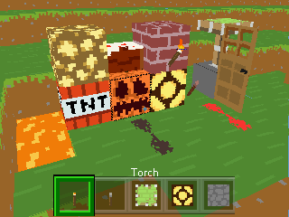

# [Bare Bones](https://www.curseforge.com/minecraft/texture-packs/bare-bones-texture-pack)
RobotPants

From [Curse Forge](https://www.curseforge.com/minecraft/texture-packs/bare-bones-texture-pack):  
Bare Bones is a texture pack with the purpose of bringing your world and the default Minecraft textures to it's 'bare bones'. It is a simplistic and vibrant pack that is fun to use and makes your own Minecraft worlds look colourful!

Bare Bones is created by RobotPants who has allowed its use in Crafti, if you want to use this texture please contact RobotPants via the Bare Bones Discord server  
 

## Screenshots

